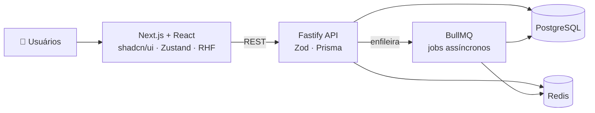

<p align="center">
  
</p>

<p align="center">
  
</p>

<p align="center">
  <a href="https://francodev.online"></a>
  <a href="https://www.linkedin.com/in/jo%C3%A3o-franco-ab9179258/"></a>
  <a href="mailto:seuemail@dominio.com"></a>
</p>

---

## 👨‍💻 `whoami`

```ts
const joao = {
  cargo: "Full Stack Developer @ Polícia Militar do Pará",
  local: "Belém, PA 🇧🇷",
  emProducao: ["Boletim Acadêmico", "SGD", "Gerador de Contratos", "Plataforma EAD", "PICC"],
  formacao: "Mestrado em Ciência da Computação — UFPA (em andamento)",
  certificacoes: ["AWS Certified Cloud Practitioner"],
  aprendendoAgora: ["Java", "Angular"],
  filosofia: "Resolver problemas reais com código que o próximo dev consiga entender.",
} as const;
```

Construo sistemas internos que estão **em produção atendendo o efetivo da PMPA** — do frontend ao backend, passando por filas, infraestrutura e observabilidade. Não é projeto de tutorial: é software com usuário de verdade, deploy de verdade e bug de verdade às 8h da manhã. 😅

---

## 🏗️ Por dentro de um sistema em produção

O **[Sistema de Boletim Acadêmico](https://boletimacademico.pm.pa.gov.br)** em uma visão simplificada:



> Validação de ponta a ponta com **Zod** (formulário → API), processamento pesado fora do ciclo de request com **BullMQ**, e **Prisma** tipando o acesso ao banco.

---

## 🚀 Projetos

### 🏛️ Em produção — PMPA
<sub>Código institucional (privado). Links levam aos sistemas no ar.</sub>

| | Projeto | O que resolve | Stack |
|---|---|---|---|
| 📘 | **[Boletim Acadêmico](https://boletimacademico.pm.pa.gov.br)** | Gestão de notas e boletins acadêmicos militares | Next.js · TypeScript · Fastify · Prisma · PostgreSQL · Redis · BullMQ |
| 👩‍🏫 | **[SGD](https://sgd.pm.pa.gov.br)** | Cadastro e gestão dos docentes da corporação | React · Vite · TypeScript · shadcn/ui |
| 📄 | **Gerador de Contratos** | Automatiza a geração de contratos administrativos | Django · FastAPI · PostgreSQL · Redis · Celery · Docker |
| 🎓 | **[Plataforma EAD](https://ead.pm.pa.gov.br)** | Ambiente virtual de capacitação do efetivo | Moodle · PHP · MariaDB · Apache · Nginx · Linux |
| 🪖 | **PICC** | Classificação por níveis de formação militar | PostgreSQL |

<details>
<summary><b>💼 Projetos pessoais & freelance</b></summary>
<br>

| Projeto | O que é | Stack | Link |
|---|---|---|---|
| 🎮 Jogo 2D/3D | Projeto pessoal de game dev | C# · Unity | [Repo](https://github.com/joaofranco02/projeto-unity) |
| 🌐 Studio Soares Deize | Site institucional para cliente | HTML · CSS · JavaScript | [Repo](https://github.com/joaofranco02/projeto-spa) |

</details>

---

## 🧰 Stack

<table>
  <tr>
    <td align="center" width="130"><b>Frontend</b></td>
    <td></td>
  </tr>
  <tr>
    <td align="center"><b>Backend</b></td>
    <td> </td>
  </tr>
  <tr>
    <td align="center"><b>Dados & Filas</b></td>
    <td>  </td>
  </tr>
  <tr>
    <td align="center"><b>DevOps & Obs.</b></td>
    <td> </td>
  </tr>
</table>

<details>
<summary><b>➕ Outras ferramentas</b></summary>
<br>


</details>

---

## 🔭 Agora mesmo

- ☕ Aprofundando **Java**
- 🅰️ Fechando a lacuna em **Angular**
- 🎓 Pesquisando no **Mestrado em Ciência da Computação (UFPA)**
- 💬 Aberto a conversar sobre **backend, sistemas em produção e arquitetura**

---

## 📊 Atividade

> A maior parte do meu código de produção vive em repositórios privados — isto aqui é só a ponta do iceberg. 🧊

<p align="center">
  
</p>

<p align="center">
  <picture>
    <source media="(prefers-color-scheme: dark)" srcset="https://raw.githubusercontent.com/joaofranco02/joaofranco02/output/github-snake-dark.svg" />
    
  </picture>
</p>

---

<p align="center">
  ⭐ Curtiu algum projeto? Deixa uma estrela ou me chama no <a href="https://www.linkedin.com/in/jo%C3%A3o-franco-ab9179258/">LinkedIn</a>.
</p>

<p align="center">
  
</p>
